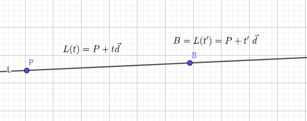
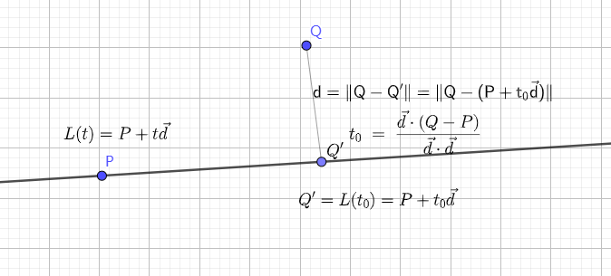
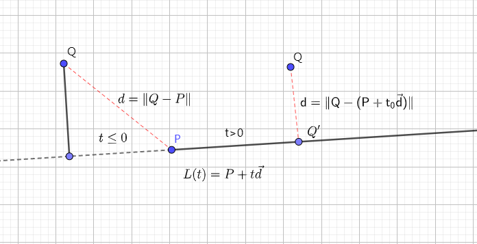
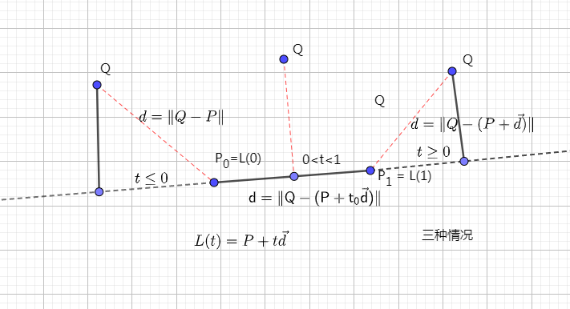

# 第一章 点与线性元素的距离

基于 js 开源项目：计算机几何算法库 Compute Geometry Algorithm（CGA），开源地址：即将到来

## 点与线

> 点由z,y,z三个坐标组成，可以表示为$Point(x,y,z)$

> 直线可以表示为$L(t)=P+t\vec{d}$, $P$是直线上的一点，$\vec{d}$是直线的方向。
> $B$是直线上任意的一点
>
> 

## 点到直线

> 假设我们有点$Q$和直线$L(t)=P+t\vec{d}$,我们要找出点$Q$与$L$的最短距离，如果$L$上离$P$最近的点$Q^\prime$ ，$Q^\prime$ 在直线上，此时$t=t_0$
>
>  
>
>  $t_0$满足：
> $$
> t_0 = \frac{\vec{d}\cdot(Q-P)}{\vec{d}\cdot\vec{d}}
> $$
>
> 并且可以确定
>
> $$
> Q^\prime = P+t_0\vec{d}
> $$
>
> 那么点 Q 到直线 L 的距离为 d，说明:$\|x\|$符号表示$x$向量的长度(范数)
>
> $$
> \begin{aligned}
> d &= \|Q-Q^\prime\|\\
> &=\|Q-(P+t_0\vec{d})\|
> \end{aligned}
> $$
>
> 当$\vec{d}$为单位矩阵$||\vec{d}\|=\vec{d}\cdot\vec{d}=1$,那么
>
> $$
> t_0 =\vec{d}\cdot(Q-P)
> $$
>
> 伪代码如下，JavaScript：

```javascript
/**
* 点到直线的距离
* @param  {Point} point
* @param  {Line} line
* @returns
* {
*    lineParameter 最近点的参数
*    lineCloset 最近点
*    distanceSqr //到最近点距离的平方
*    distance//到最近点距离
* }
*/
function distancePointLine(point，line) {
    var result = {};
    var diff = point.clone().sub(line.origin);
    result.lineParameter = line.direction.dot(diff);
    result.lineCloset = line.direction
      .clone()
      .multiplyScalar(result.lineParameter)
      .add(line.origin);

    diff = point.clone().sub(result.lineCloset);
    result.distanceSqr = diff.dot(diff);
    result.distance = Math.sqrt(result.distanceSqr);
    return result;
  }
```

## 点到射线和线段

1. 点到射线

   > 如果$L$是直线，上文已经详细说过. 如果$L$是射线，那么我们限制$t$为非负数$t>=0$, $t_0$ 是点$Q$到射线的最近点的系数，如果$t_0>0$,那么点$Q$到最近点的的线是与$L$垂直的，但是如果 $t_0<0$是，$Q$到射线所在的直线上的最近点是在射线之外，那么最近点，就是到$L$的原点
   >
   > $$
   > d=\left\{
   > \begin{aligned}
   > &\|Q-P\| & t_0\leq0 \\
   > &\|Q-(P+t_0\vec{d})\| &t_0>0
   > \end{aligned}
   > \right .
   > $$
   >
   > 图示如下：
   > 

2. 点到射线
   > 线段可以定义成两个端点$P_0,P_1$,方向可以定义为
   > $$\vec{d}=P_1-P_0$$
   > 根据$L(t)$的定义，两个端点可以表示为 $P_0=L(0),P_1 = L(1)$,我们就可以得到点到线段的最短距离$d$的方程:
   >
   > $$
   > d=\left\{
   > \begin{aligned}
   > &\|Q-P\| &t_0\leq0 \\
   > &\|Q-(P+t_0\vec{d})\| & 0 <t_0<1\\
   > &\|Q-(P+\vec{d})\| & t_0\geq 1
   > \end{aligned}
   > \right .
   > $$
   >
   > 图是如下:
   > 
